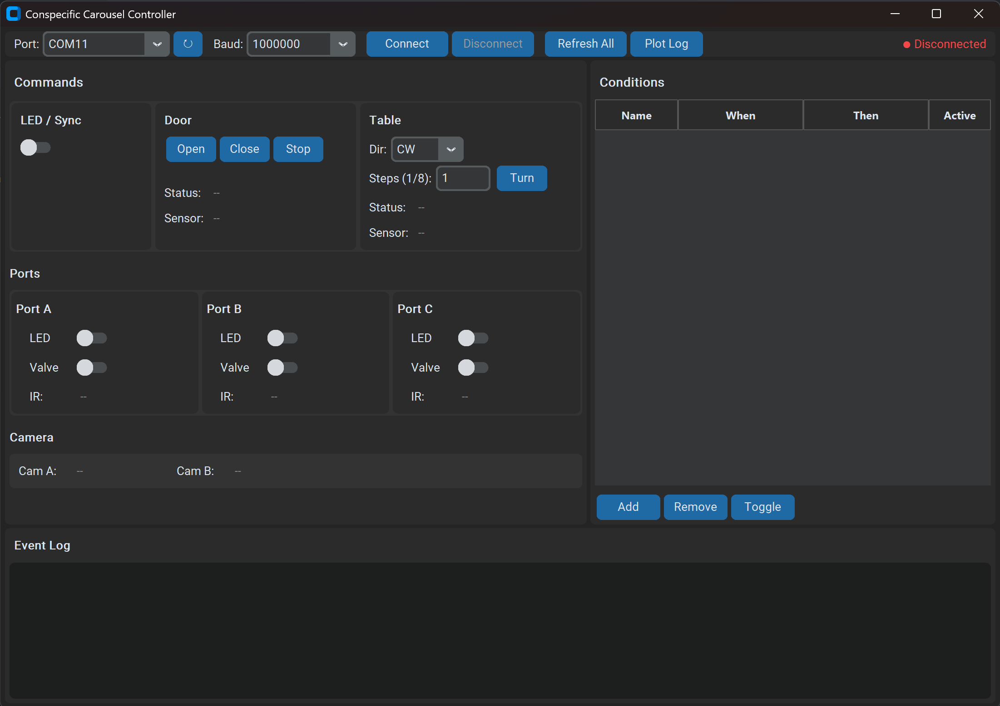

# Conspecific Carousel


An automated behavioral apparatus for rat/mice social interaction experiments with rotating arena and multiple nose-poke ports.


The Conspecific Carousel is a behavioral testing apparatus designed for rodent social interaction studies. It features a computer-controlled rotating platform (8 positions), automated door mechanism, and three nose-poke ports with beambreak detection, LED cues, and water/reward delivery. The system enables precise control of animal access and position while synchronizing with external recording equipment.

## 🔧 Features

- **8-Position Rotary Table** - Dynamixel servo-driven platform with 45° indexing
- **Automated Door Control** - Dynamixel servo with position feedback for entry/exit control
- **Nose Poke Ports** - Individual LED illumination, valve control, and beambreak detection (Ports A, B, C)
- **Camera Synchronization** - BNC outputs for frame-accurate event timing
- **Modular Beambreak Arrays** - Available in L (large) and S (small) configurations

## 🌐 View Online (eCAD)

View the complete electronic design project online via [Altium 365 Viewer](https://sainsburywellcomecentre.github.io/fablabs-documentation/#conspecific-carousel)

## 🚀 Getting Started

### Hardware Assembly

1. **Assemble PCBs** - Order and assemble all five PCBs (main controller + 4 beambreak arrays) using provided fabrication files
2. **Install Motors** - Mount Dynamixel servos for door and table rotation mechanisms
3. **Connect Sensors** - Wire beambreak arrays to nose poke ports and position sensors to door/table
4. **Power Up** - Connect 12V power supply for motors and USB for control/communication

### Firmware Installation

1. **Enter bootloader mode** - Hold BOOTSEL button while connecting USB
2. **Copy firmware** - Transfer all files from `firmware/` folder to the device
3. **Verify** - Device should appear as USB serial port and respond to commands

### Desktop App Control

1. **Install dependencies** - Run `pip install -r requirements.txt` in the `software/` directory
2. **Run app** - Execute `python main.py` to launch the control interface
3. **Connect to device** - Select the serial port and baud in the app settings

```bash
cd software
pip install -r requirements.txt
python main.py
```

## 📡 Communication Protocol

### Register Map

#### System

| Register | Address | Type  | Description                                     |
| -------- | ------- | ----- | ----------------------------------------------- |
| LED/Sync | `0x01`  | `R/W` | `0x00`: off, `0x01`: on — controls sync_out/LED |

#### Door

| Register     | Address | Type | Description                                                    |
| ------------ | ------- | ---- | -------------------------------------------------------------- |
| Door Status  | `0x10`  | `R`  | `0x00`: closed, `0x01`: opened, `0x02`: moving, `0x03`: paused |
| Door Command | `0x11`  | `W`  | `0x00`: open, `0x01`: close, `0x02`: stop                      |

#### Table

| Register      | Address | Type | Description                                                                  |
| ------------- | ------- | ---- | ---------------------------------------------------------------------------- |
| Table Status  | `0x18`  | `R`  | `0x00`: stopped, `0x01`: moving                                              |
| Table Command | `0x19`  | `W`  | bit 7: direction (`0` = CW, `1` = CCW), bits 0–6: position in 1/8-turn units |

#### Side Sensors

| Register     | Address | Type | Description                                         |
| ------------ | ------- | ---- | --------------------------------------------------- |
| Door Sensor  | `0x02`  | `R`  | `0x00`: no object detected, `0x01`: object detected |
| Table Sensor | `0x03`  | `R`  | `0x00`: no object detected, `0x01`: object detected |

#### Peripherals — Port A / B / C

| Register         | Port A | Port B | Port C | Type  | Description                                         |
| ---------------- | ------ | ------ | ------ | ----- | --------------------------------------------------- |
| LED Status       | `0x21` | `0x24` | `0x27` | `R/W` | `0x00`: off, `0x01`: on                             |
| Valve Status     | `0x22` | `0x25` | `0x28` | `R/W` | `0x00`: off, `0x01`: on                             |
| IR Sensor Status | `0x23` | `0x26` | `0x29` | `R`   | `0x00`: no object detected, `0x01`: object detected |

#### Camera

| Register    | Address | Type | Description         |
| ----------- | ------- | ---- | ------------------- |
| Cam A State | `0x04`  | `R`  | Current Cam A state |
| Cam B State | `0x05`  | `R`  | Current Cam B state |

### TX Protocol (Host → Device)

| Byte 3 | Byte 2   | Byte 1       | Byte 0 |
| ------ | -------- | ------------ | ------ |
| Header | Register | Message Type | Value  |

- **Header**: `0xCC`
- **Register**: Address from the register map
- **Message Type**: `0x01` Write, `0x02` Read
- **Value**: Data to write (ignored for Read)

### RX Protocol (Device → Host)

| Byte 3 | Byte 2   | Byte 1       | Byte 0 |
| ------ | -------- | ------------ | ------ |
| Header | Register | Message Type | Value  |

- **Header**: `0xCC`
- **Register**: Address of the register being reported
- **Message Type**: `0x02` Acknowledgement, `0x03` Event Notification
- **Value**: Current register value

#### Event Notifications

Events are sent asynchronously by the device when hardware state changes:

| Source       | Register      | Trigger                     |
| ------------ | ------------- | --------------------------- |
| Door         | `0x10`        | Door status changed         |
| Table        | `0x18`        | Table started/stopped       |
| Port A–C IR  | `0x23`–`0x29` | Beambreak triggered/cleared |
| Door Sensor  | `0x02`        | Door sensor state changed   |
| Table Sensor | `0x03`        | Table sensor state changed  |
| Cam A        | `0x04`        | Cam A state changed         |
| Cam B        | `0x05`        | Cam B state changed         |

### Configuration

- TX Buffer Length: 128 bytes
- RX Buffer Length: 128 bytes

## 🖥️ Software Guide



1. **Connect to device** — Select the serial port and baud rate in the app settings
2. **Monitor events** — View real-time sensor states and event logs in the app interface
3. **Control hardware** — Use app controls to operate the door, rotate the table, and manage nose poke ports
4. **Log data** — All events are automatically recorded while the app is running, saved in `./log/` with timestamped filenames for later analysis
5. **Integrate with experiments** — Use BNC outputs to synchronize with external recording equipment for precise event timing
6. **Customize conditions** — Define automation rules with AND/OR/NOT logic triggers in the right panel to execute actions based on sensor states

## 💻 Software Requirements

- **Python 3.8+** — Required for running the desktop control app
  - Dependencies: `pyserial`, `customtkinter`, `matplotlib` (see `software/requirements.txt`)
- **MicroPython** — Firmware runtime on the microcontroller

To view or edit the source design files:

- **Altium Designer 20.0+** _(electronic design)_ — Academic licenses via [Altium Education](https://www.altium.com/education)
- **Inventor 2025+** _(mechanical design)_ — Academic licenses via [Autodesk Education](https://www.autodesk.com/education/free-software/inventor)

## 📜 License

**Sainsbury Wellcome Centre hardware is released under** [Creative Commons Attribution-ShareAlike 4.0 International](http://creativecommons.org/licenses/by-sa/4.0/).

You are free to:

- **Share** — copy and redistribute the material in any medium or format
- **Adapt** — remix, transform, and build upon the material for any purpose

Under the following terms:

- **Attribution** — Give appropriate credit, link to the license, and indicate changes.
- **ShareAlike** — Distribute your contributions under the same license.
- **No additional restrictions** — Don't apply legal or technological measures that prevent others from doing anything the license permits.

> For the full legal text, see [LICENSE](LICENSE).

## 📚 References _(if applicable)_

If your research uses this apparatus, please cite:

```bibtex
@misc{ConspecificCarousel2026,
  title     = "Conspecific Carousel: Automated Behavioral Apparatus for Rodent Social Interaction",
  author    = "Sainsbury Wellcome Centre",
  year      = "2026",
  publisher = "GitHub",
  url       = "https://github.com/SainsburyWellcomeCentre/conspecific-carousel"
}
```
